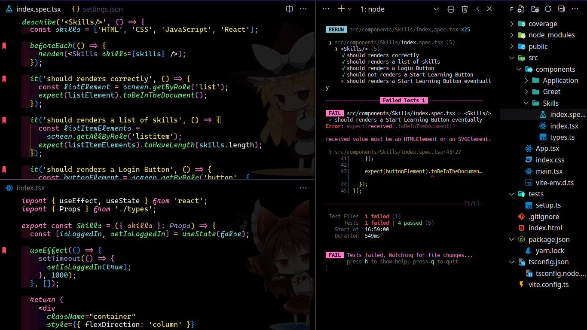

# suegoidkun-theme

## How to use it

Clone the project and paste it in .vscode/extensions  
Then select it from >Preferences: Color Theme

### Font Family: `Cascadia Code`

### Appearance Extensions:

- indent-rainbow
- background
- Material Icon Theme
